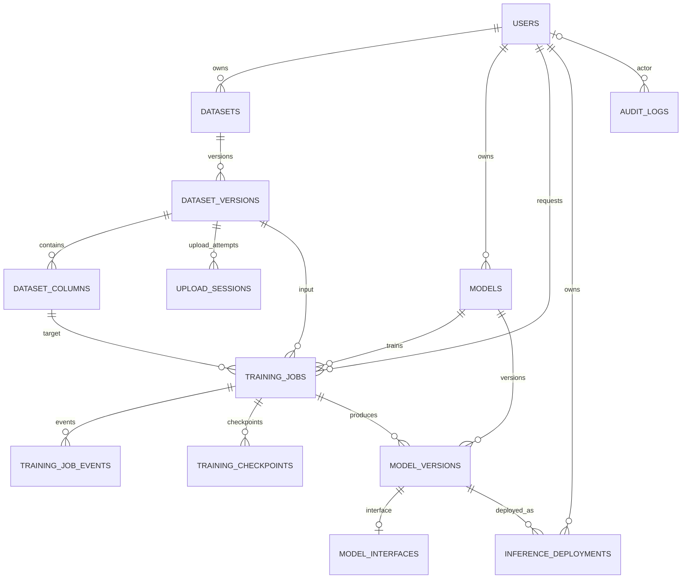

# ArgMax Mini Full Database Relationship ERD

이 문서는 `data-model-v5.md`와 `database/schema-v2.sql`을 기준으로 작성한 Mermaid ERD다.

## 1. 관계 개요

## 2. 상세 물리 ERD

```mermaid
erDiagram
    USERS {
        uuid id PK
        varchar email
        timestamptz created_at
    }

    DATASETS {
        uuid id PK
        uuid user_id FK
        varchar name
        text description
        timestamptz created_at
        timestamptz updated_at
        timestamptz deleted_at
    }

    DATASET_VERSIONS {
        uuid id PK
        uuid dataset_id FK
        integer version_number
        varchar original_filename
        varchar file_format
        varchar mime_type
        bigint size_bytes
        text original_storage_uri
        text processed_storage_uri
        varchar checksum_algorithm
        varchar checksum
        bigint row_count
        integer column_count
        varchar status
        varchar error_code
        text error_message
        timestamptz processing_started_at
        timestamptz processing_finished_at
        timestamptz created_at
        timestamptz updated_at
    }

    DATASET_COLUMNS {
        uuid id PK
        uuid dataset_version_id FK
        varchar name
        integer ordinal_position
        varchar data_type
        varchar physical_type
        boolean is_nullable
        bigint null_count
        bigint distinct_count
        jsonb statistics_json
        timestamptz created_at
    }

    UPLOAD_SESSIONS {
        uuid id PK
        uuid dataset_version_id FK
        varchar status
        text storage_key
        varchar upload_method
        text upload_id
        bigint expected_size_bytes
        varchar expected_checksum_algorithm
        varchar expected_checksum
        integer part_size_bytes
        timestamptz expires_at
        timestamptz completed_at
        timestamptz aborted_at
        varchar error_code
        text error_message
        timestamptz created_at
        timestamptz updated_at
    }

    MODELS {
        uuid id PK
        uuid user_id FK
        varchar name
        text description
        timestamptz created_at
        timestamptz updated_at
        timestamptz deleted_at
    }

    TRAINING_JOBS {
        uuid id PK
        uuid user_id FK
        uuid model_id FK
        uuid dataset_version_id FK
        uuid target_column_id FK
        varchar status
        varchar algorithm
        jsonb hyperparameters
        integer requested_gpu_count
        varchar idempotency_key
        varchar mlflow_run_id
        timestamptz started_at
        timestamptz finished_at
        timestamptz cancel_requested_at
        varchar error_code
        text error_message
        timestamptz created_at
        timestamptz updated_at
    }

    TRAINING_JOB_EVENTS {
        uuid id PK
        uuid training_job_id FK
        varchar event_type
        varchar from_status
        varchar to_status
        text message
        jsonb metadata_json
        timestamptz occurred_at
    }

    TRAINING_CHECKPOINTS {
        uuid id PK
        uuid training_job_id FK
        integer sequence_number
        bigint epoch
        bigint step
        text storage_uri
        bigint size_bytes
        varchar checksum_algorithm
        varchar checksum
        boolean is_resumable
        timestamptz created_at
    }

    MODEL_VERSIONS {
        uuid id PK
        uuid model_id FK
        uuid training_job_id FK
        integer version_number
        integer candidate_number
        varchar status
        text artifact_uri
        varchar artifact_format
        jsonb metrics_json
        varchar mlflow_run_id
        varchar error_code
        text error_message
        timestamptz created_at
        timestamptz updated_at
    }

    MODEL_INTERFACES {
        uuid id PK
        uuid model_version_id FK, UK
        jsonb input_schema_json
        jsonb output_schema_json
        varchar schema_version
        timestamptz created_at
    }

    INFERENCE_DEPLOYMENTS {
        uuid id PK
        uuid user_id FK
        uuid model_version_id FK
        varchar name
        varchar environment
        varchar status
        varchar kserve_namespace
        varchar kserve_service_name
        text endpoint
        integer min_replicas
        integer max_replicas
        jsonb traffic_config_json
        timestamptz operation_started_at
        integer applied_min_replicas
        integer applied_max_replicas
        varchar error_code
        text error_message
        timestamptz created_at
        timestamptz updated_at
    }

    AUDIT_LOGS {
        uuid id PK
        varchar actor_type
        uuid actor_user_id FK
        varchar action
        varchar resource_type
        uuid resource_id
        varchar request_id
        varchar result
        varchar error_code
        jsonb metadata_json
        timestamptz occurred_at
    }

    OUTBOX_EVENTS {
        uuid id PK
        varchar aggregate_type
        uuid aggregate_id
        varchar event_type
        jsonb payload_json
        varchar idempotency_key
        timestamptz occurred_at
        timestamptz published_at
        integer retry_count
        text last_error
        timestamptz next_attempt_at
    }

    USERS ||--o{ DATASETS : "user_id"
    DATASETS ||--o{ DATASET_VERSIONS : "dataset_id"
    DATASET_VERSIONS ||--o{ DATASET_COLUMNS : "dataset_version_id"
    DATASET_VERSIONS ||--o{ UPLOAD_SESSIONS : "dataset_version_id"

    USERS ||--o{ MODELS : "user_id"
    USERS ||--o{ TRAINING_JOBS : "user_id"
    MODELS ||--o{ TRAINING_JOBS : "model_id"
    DATASET_VERSIONS ||--o{ TRAINING_JOBS : "dataset_version_id"
    DATASET_COLUMNS ||--o{ TRAINING_JOBS : "target_column_id"

    TRAINING_JOBS ||--o{ TRAINING_JOB_EVENTS : "training_job_id"
    TRAINING_JOBS ||--o{ TRAINING_CHECKPOINTS : "training_job_id"
    TRAINING_JOBS ||--o{ MODEL_VERSIONS : "training_job_id"
    MODELS ||--o{ MODEL_VERSIONS : "model_id"

    MODEL_VERSIONS ||--o| MODEL_INTERFACES : "model_version_id"
    USERS ||--o{ INFERENCE_DEPLOYMENTS : "user_id"
    MODEL_VERSIONS ||--o{ INFERENCE_DEPLOYMENTS : "model_version_id"

    USERS o|--o{ AUDIT_LOGS : "actor_user_id"
```

## 3. Mermaid로 직접 표현되지 않는 제약

Mermaid ERD의 키 표기는 전체 PostgreSQL 제약을 모두 표현하지 못하므로 다음 제약은 `database/schema-v2.sql`을 기준으로 한다.

표현식 기반 또는 조건부 partial UNIQUE는 일반 컬럼 `UK`로 오해될 수 있으므로 상세 ERD의 필드 표기에서는 생략하고 아래 표에 정확한 조건을 기록한다.

| 대상 | 실제 제약 |
|---|---|
| `users.email` | `lower(btrim(email))` 기준 대소문자 무관 expression UNIQUE |
| `datasets` | 활성 행에 대해 `(user_id, lower(btrim(name)))` partial UNIQUE |
| `models` | 활성 행에 대해 `(user_id, lower(btrim(name)))` partial UNIQUE |
| `dataset_versions` | `(dataset_id, version_number)` UNIQUE |
| `dataset_columns` | `(dataset_version_id, ordinal_position)` UNIQUE 및 `lower(btrim(name))` 기준 대소문자 무관 expression UNIQUE |
| `upload_sessions.upload_id` | `upload_id IS NOT NULL`인 행에 대해 partial UNIQUE |
| `upload_sessions` | DatasetVersion당 활성 세션 최대 1개, 완료 세션 최대 1개인 partial UNIQUE |
| `upload_sessions.upload_method` | `SINGLE_PUT` 또는 `MULTIPART`; SINGLE_PUT은 `upload_id`, `part_size_bytes`가 모두 NULL이고 MULTIPART는 둘 다 NULL이 아님 |
| `training_jobs` | `(user_id, idempotency_key)` UNIQUE |
| `training_checkpoints` | `(training_job_id, sequence_number)` UNIQUE |
| `model_versions` | `(model_id, version_number)` 및 `(training_job_id, candidate_number)` UNIQUE |
| `model_interfaces` | `model_version_id` UNIQUE로 최대 1개 보장 |
| `inference_deployments` | 미삭제 배포 이름 및 KServe 리소스 partial UNIQUE |

## 4. 다형적 참조 및 서비스 계층 불변식

- `audit_logs.resource_id`는 여러 리소스 유형을 참조하므로 FK가 없다.
- `outbox_events.aggregate_id`는 여러 aggregate 유형을 참조하므로 FK가 없다.
- `InferenceDeployment.user_id`는 참조 ModelVersion의 Model 소유자와 같아야 한다.
- `ModelVersion.model_id`는 참조 TrainingJob의 `model_id`와 같아야 한다.
- TrainingJob 생성 시 DatasetVersion은 `READY`여야 한다.
- TrainingJob을 `SUCCEEDED`로 전이하려면 최소 1개의 `READY` ModelVersion과 해당 ModelInterface가 존재해야 한다.

## 5. FK 삭제 정책 요약

| FK 컬럼 | 참조 대상 | ON DELETE |
|---|---|---|
| `datasets.user_id` | `users.id` | `RESTRICT` |
| `dataset_versions.dataset_id` | `datasets.id` | `CASCADE` |
| `dataset_columns.dataset_version_id` | `dataset_versions.id` | `CASCADE` |
| `upload_sessions.dataset_version_id` | `dataset_versions.id` | `CASCADE` |
| `models.user_id` | `users.id` | `RESTRICT` |
| `training_jobs.user_id` | `users.id` | `RESTRICT` |
| `training_jobs.model_id` | `models.id` | `RESTRICT` |
| `training_jobs.dataset_version_id` | `dataset_versions.id` | `RESTRICT` |
| `training_jobs.target_column_id` | `dataset_columns.id` | `RESTRICT` |
| `training_job_events.training_job_id` | `training_jobs.id` | `CASCADE` |
| `training_checkpoints.training_job_id` | `training_jobs.id` | `CASCADE` |
| `model_versions.model_id` | `models.id` | `RESTRICT` |
| `model_versions.training_job_id` | `training_jobs.id` | `RESTRICT` |
| `model_interfaces.model_version_id` | `model_versions.id` | `CASCADE` |
| `inference_deployments.user_id` | `users.id` | `RESTRICT` |
| `inference_deployments.model_version_id` | `model_versions.id` | `RESTRICT` |
| `audit_logs.actor_user_id` | `users.id` | `SET NULL` |
