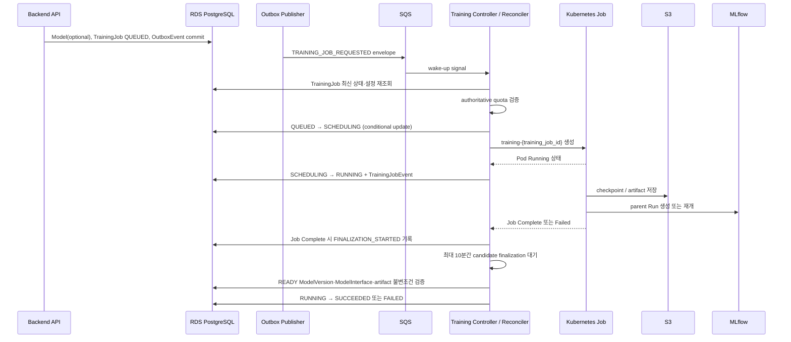

# ArgMax Mini Training Pipeline Design

## 1. 문서 목적과 범위

이 문서는 TrainingJob의 생성부터 GPU 학습, checkpoint, 성공 판정까지의 운영 목표 설계를 정의한다. RDB 상세는 [data-model-v5.md](data-model-v5.md), 상태 전이는 [state-transitions-v4.md](state-transitions-v4.md), 시스템 경계는 [system-context-v3.md](system-context-v3.md), 선택 근거는 [architecture-decisions-v3.md](architecture-decisions-v3.md)를 따른다.

이는 운영 목표 설계다. 48시간 과제 구현 범위에는 Kubernetes manifest, AWS 리소스, Controller, SQS, MLflow의 실제 구축이 포함되지 않는다.

## 2. 설계 원칙과 기준 저장소

- SQS는 빠른 처리 시작을 위한 wake-up signal이다.
- RDS PostgreSQL은 TrainingJob의 비즈니스 상태와 실행 의도의 영속적 기준 저장소다.
- Periodic Reconciler는 메시지 누락, DLQ 이동, Controller 장애, Kubernetes 상태 불일치를 복구하는 최종 안전망이다.
- Training Controller는 SQS payload만 신뢰하지 않고 `training_job_id`로 RDS의 최신 상태와 실행 설정을 다시 조회한다.



## 3. TrainingJob 생성과 불변조건

신규 Model 최초 학습은 한 PostgreSQL 트랜잭션에서 `Model`, `TrainingJob(status=QUEUED)`, `OutboxEvent(TRAINING_JOB_REQUESTED)`를 생성한다. 기존 Model 재학습은 `TrainingJob`과 동일 OutboxEvent만 생성한다.

`dataset_version_id`는 요청에서 명시하며 `latest_ready_version`을 자동 선택하지 않는다. 서비스 계층은 DatasetVersion 존재·`READY` 상태·상위 Dataset 미삭제·요청 사용자 소유·대상 Model과 같은 사용자 소유를 검증한다.

## 4. Idempotency

DB의 `UNIQUE(user_id, idempotency_key)`는 API 요청 멱등성 제약이다. 동일 키 재요청은 기존 TrainingJob을 반환하기 전에 원래 요청과 핵심 필드를 비교한다.

| 요청 | 비교 필드 |
|---|---|
| 신규 Model 학습 | `Model.name`, `Model.description`, `dataset_version_id`, `algorithm`, `hyperparameters`, `requested_gpu_count` |
| 기존 Model 재학습 | `model_id`, `dataset_version_id`, `algorithm`, `hyperparameters`, `requested_gpu_count` |

Model 이름은 `lower(btrim(name))`으로 비교한다. 모두 같으면 Soft Delete된 Model을 포함해 기존 결과를 반환하고, 하나라도 다르면 `409 Conflict`와 `IDEMPOTENCY_KEY_REUSED`를 반환한다.

## 5. Transactional Outbox와 SQS 계약

학습 요청 이벤트는 다음과 같이 기록한다.

```text
aggregate_type = TRAINING_JOB
aggregate_id = training_job_id
event_type = TRAINING_JOB_REQUESTED
```

`payload_json`은 `training_job_id`, `model_id`, `dataset_version_id`, `user_id`, `requested_gpu_count`를 담는다. SQS envelope의 `data`는 이를 변형 없이 복사하고, `schema_version`은 envelope 최상단에만 둔다. payload 안에 `schema_version`을 중복 저장하지 않는다.

```json
{
  "event_id": "outbox-event-uuid",
  "event_type": "TRAINING_JOB_REQUESTED",
  "aggregate_type": "TRAINING_JOB",
  "aggregate_id": "training-job-uuid",
  "occurred_at": "ISO-8601",
  "schema_version": "1.0",
  "data": {
    "training_job_id": "uuid",
    "model_id": "uuid",
    "dataset_version_id": "uuid",
    "user_id": "uuid",
    "requested_gpu_count": 1
  }
}
```

Consumer 멱등성은 `event_id`, `training_job_id`, 조건부 상태 UPDATE, 결정적 Kubernetes Job 이름으로 보장한다. `OutboxEvent.idempotency_key`는 API 요청과 이벤트의 감사·추적 metadata이며 Consumer 판단에 사용하지 않는다. 지원하지 않는 envelope `schema_version`은 non-retryable consumer error로 분류하여 DLQ 또는 격리 큐로 이동한다.

## 6. Training Controller와 Periodic Reconciliation

Controller는 여러 replica를 허용한다. `QUEUED → SCHEDULING`을 아래 조건부 UPDATE로 획득하고, Job 이름 `training-{training_job_id}` 및 조건부 상태 변경으로 중복 생성을 방지한다.

```sql
UPDATE training_jobs
SET status = 'SCHEDULING', updated_at = now()
WHERE id = :training_job_id AND status = 'QUEUED';
```

SCHEDULING·RUNNING·CANCEL_REQUESTED에서의 중복 Kubernetes GET은 허용한다. 초기 범위에는 reconciliation lease, claim 컬럼, 추가 partial unique index를 도입하지 않는다.

기본 SQS 설정은 visibility timeout 60초, 30초 경과 시 60초 연장, 메시지당 최대 연장 5분, `maxReceiveCount=8`, source retention 4일, DLQ retention 14일이다. DLQ는 복구의 유일한 수단이 아니라 운영 증거와 격리 수단이다.

Reconciler는 60초마다 `QUEUED`, `SCHEDULING`, `RUNNING`, `CANCEL_REQUESTED` 상태별 최대 100건을 RDS 기준으로 검사한다.

| 상태 | Reconciler 처리 |
|---|---|
| QUEUED | quota 가능 시 SCHEDULING으로 조건부 전이 후 Job 생성. 부족 시 QUOTA_WAITING 기록 후 메시지 삭제. |
| SCHEDULING | Pod가 Running이면 RUNNING. 30분 초과면 `SCHEDULING_TIMEOUT`으로 FAILED. |
| RUNNING | Job이 없으면 최초 `ORPHAN_JOB_DETECTED` 시각부터 5분 grace를 적용하고, 계속 없으면 `KUBERNETES_JOB_LOST`로 FAILED. |
| CANCEL_REQUESTED | Job 삭제·종료를 확인해 CANCELLED 또는 기존 상태 모델의 종단 상태로 전이. |

`ORPHAN_JOB_DETECTED`의 grace 시작은 해당 Job의 가장 이른 `(occurred_at, id)` 이벤트다. UUID `id`는 생성 순서가 아니라 timestamp 동률의 결정적 타이브레이커다. 단일 Controller는 재삽입하지 않으며 다중 Controller의 관측 중복은 허용한다.

## 7. GPU Quota와 Scheduling

API의 quota 검증은 best-effort이며 동시 요청 race로 짧은 초과가 가능하다. Controller는 scheduling 직전에 authoritative 재검증한다.

- quota 부족은 오류나 메시지 처리 실패가 아니다. Job은 `QUEUED`를 유지하고 Kubernetes Job을 생성하지 않으며 SQS 메시지는 삭제한다.
- `QUOTA_WAITING`은 최근 이벤트 기준 최소 15분 간격으로 기록한다.
- API는 quota 초과를 `409 Conflict`, `GPU_QUOTA_EXCEEDED`로 응답한다.
- `created_at + 72시간`을 scheduling deadline으로 사용한다. Reconciler가 정상 동작 중 초과를 발견하면 `GPU_QUOTA_WAIT_TIMEOUT`으로 `QUEUED → FAILED`를 허용한다. DB가 자동 만료시키지는 않는다.

Reconciler 가용성은 quota 대기 TrainingJob의 실제 유효 수명에 영향을 준다. Reconciler가 장기 중단 후 복구되면 72시간을 초과한 다수의 `QUEUED` Job이 한 번에 `GPU_QUOTA_WAIT_TIMEOUT`으로 `FAILED` 처리될 수 있다.

`WAITING_FOR_QUOTA`는 별도 상태로 추가하지 않는다.

## 8. Kubernetes GPU Training Job과 시간 경계

초기 Algorithm Registry는 애플리케이션의 versioned constant이며 `XGBOOST_CLASSIFIER`, `XGBOOST_REGRESSOR`만 지원한다. `SKLEARN_CLASSIFIER`, `SKLEARN_REGRESSOR` 등 generic CPU training algorithm은 초기 Registry에 포함하지 않는다. `training_jobs.algorithm`은 문자열 컬럼을 유지하고, 지원 가능 값은 애플리케이션 registry에서 제한한다.

지원 알고리즘은 GPU-capable XGBoost로 한정한다. Training Runtime은 `tree_method=hist`, `device=cuda`(사용 중인 XGBoost 버전의 동등한 공식 GPU 설정 포함)를 강제하며, 사용자는 device나 GPU backend를 hyperparameter로 override할 수 없다. 따라서 `nvidia.com/gpu` request=limit의 Pod allocation과 실제 CUDA algorithm execution이 함께 충족되어야 한다.

```yaml
metadata:
  name: training-{training_job_id}
spec:
  completions: 1
  parallelism: 1
  backoffLimit: 1
  activeDeadlineSeconds: 90000
  ttlSecondsAfterFinished: 86400
  template:
    spec:
      restartPolicy: Never
      terminationGracePeriodSeconds: 1800
      serviceAccountName: argmax-training-job
      automountServiceAccountToken: false
```

| 경계 | 기본값 | 책임 |
|---|---:|---|
| QUEUED deadline | 72시간 | Job 생성 전 quota 대기 한도 |
| SCHEDULING timeout | 30분 | Job 생성 후 Pod Running 전 운영 설정 |
| `MAX_TRAINING_RUNTIME_SECONDS` | 86,400초 | 학습 프로세스의 실제 실행 제어 |
| graceful shutdown | 1,800초 | final checkpoint·정상 종료 여유 |
| `activeDeadlineSeconds` | 90,000초 | Kubernetes 전체 강제 안전장치 |
| `terminationGracePeriodSeconds` | 1,800초 | SIGTERM부터 SIGKILL까지 |

최악의 리소스 점유는 약 25시간 30분이다. Training Pod는 Kubernetes API를 직접 조회하지 않는다. Resource profile은 서버가 algorithm profile, dataset size class, GPU 수로 결정하며 사용자가 CPU·메모리·ephemeral storage를 직접 지정하지 않는다.

```yaml
requests: {cpu: "4", memory: 16Gi, ephemeral-storage: 20Gi, nvidia.com/gpu: "1"}
limits: {cpu: "8", memory: 32Gi, ephemeral-storage: 50Gi, nvidia.com/gpu: "1"}
emptyDir: {sizeLimit: 40Gi}
envFrom:
  - secretRef: {name: argmax-training-runtime}
```

GPU request와 limit은 동일하다. 초기 범위에서는 GPU 공유·time-slicing·MIG·Spot을 제외하고 On-Demand를 사용한다. IRSA를 사용하며 AWS Access Key를 Kubernetes Secret에 저장하지 않는다. GPU NodePool의 실제 Karpenter API 필드는 해당 버전에 맞춰 별도 검증한다.

GPU NodePool은 GPU 전용 label, `nvidia.com/gpu=true:NoSchedule` taint, Training Pod의 toleration과 required node affinity를 사용한다. NodePool 전체 GPU 상한을 적용하고 실행 중 Job을 보호하되, 비어 있는 GPU 노드는 consolidation할 수 있다. 장기 작업 중 drift·underutilized disruption을 억제하는 구체 manifest는 검증한 Karpenter 버전에 맞춰 후속 확정한다.

### 8.1 GPU memory strategy

처리된 Parquet는 Training Job에서 XGBoost의 memory-efficient quantile input path(예: 사용 버전에서 지원하는 `QuantileDMatrix` 또는 동등 경로)로 읽어 `hist + CUDA` 학습에 사용한다. GPU 할당만으로 VRAM 여유를 보장하지 않으며, 실제 memory demand는 row·column·cardinality·표현 방식·hyperparameter·working memory에 따라 달라진다.

dataset과 working memory가 device memory에 들어가기 어려우면 XGBoost GPU external-memory training을 확장 경로로 검토한다. 고정 VRAM 비율이나 dataset size와 VRAM의 단순 1:1 기준은 정의하지 않으며, 적용 판단 기준은 운영 미해결 사항으로 남긴다. cuDF, cuML, RAPIDS RMM, Dask-CUDA와 multi-GPU distributed XGBoost는 초기 baseline에 포함하지 않는다. RMM은 실제 allocator fragmentation, allocation overhead, 여러 CUDA library의 memory contention이 관측될 때의 future optimization일 뿐이다.

## 9. Checkpoint 저장과 Resume

Checkpoint staging 경로는 `checkpoints/{training_job_id}/_staging/{checkpoint_id}/`, 최종 경로는 `checkpoints/{training_job_id}/{checkpoint_id}/`다. `checkpoint_id`는 별도 DB 컬럼이 아니라 애플리케이션이 S3 publish 전에 사전 생성하는 UUID이며 이후 INSERT되는 `TrainingCheckpoint.id`와 같은 값이다. 최종 경로에는 이 불변 UUID를 사용하고, `sequence_number`는 S3 object key가 아닌 RDB 내부의 정렬·선택 순번으로만 사용한다.

```text
checkpoint_id 생성 → 로컬 checkpoint 생성 → SHA-256·size 계산 → staging 업로드 → size/checksum 검증
→ checkpoint_id 기반 최종 immutable prefix 업로드·검증 → TrainingJob FOR UPDATE
→ `TrainingCheckpoint.id=checkpoint_id` 재조회 → 없을 때만 MAX(sequence_number)+1 할당
→ id=checkpoint_id로 TrainingCheckpoint INSERT
→ CHECKPOINT_CREATED → COMMIT → staging best-effort 삭제
```

S3에는 atomic rename이 없으므로 `TrainingCheckpoint` row가 resume 후보의 publish marker다. S3 최종 객체 검증 전에는 row를 만들거나 sequence를 예약하지 않는다. `_staging/`은 24시간 Lifecycle로 삭제한다.

Checkpoint manifest에는 `schema_version`, `checkpoint_id`, `training_job_id`, epoch, step, size, checksum, algorithm, framework·optimizer 정보와 생성 시각을 기록한다. manifest.checkpoint_id는 TrainingCheckpoint.id와, manifest.training_job_id는 TrainingCheckpoint.training_job_id와 일치해야 한다. sequence_number는 할당 전에는 알 수 없으므로 manifest 필수값이 아니며 DB row에서만 관리한다. 동일 checkpoint_id의 재호출은 final 객체와 대응 row가 모두 유효하면 멱등 성공이고, final 객체만 있으면 검증 뒤 TrainingJob 잠금·id 재조회 후 sequence 할당·INSERT를 재시도한다. INSERT가 PK 충돌을 내면 rollback·id 재조회 뒤 metadata와 storage_uri가 같으면 멱등 성공, 다르면 `CHECKPOINT_ID_CONFLICT`, row가 없으면 제한된 재시도 또는 정합성 오류로 처리한다. 이때 새 UUID를 만들지 않는다. DB row가 있는데 final 객체가 없거나 불일치하면 `is_resumable=false`와 `CHECKPOINT_INVALIDATED`로 무효화한다.

Resume은 `is_resumable=true`인 최신 5개를 `sequence_number DESC LIMIT 5`로 조회해 객체·size·SHA-256·manifest의 job/checkpoint_id·algorithm/framework·optimizer·현재 설정 호환성을 검사한다. `sequence_number`는 DB 정렬값이므로 S3 manifest와 비교하지 않는다. 무효 checkpoint는 `is_resumable=false`와 `CHECKPOINT_INVALIDATED` 이벤트로 기록하고 이전 후보를 검사한다. 다른 TrainingJob checkpoint의 자동 사용은 금지한다.

`backoffLimit: 1`의 retry Pod는 동일 Kubernetes Job·동일 TrainingJob·잔여 `activeDeadlineSeconds`를 공유한다. 유효 checkpoint가 있으면 resume하고 없으면 처음부터 재시작하며 `RUNNING → SCHEDULING` 역전은 금지한다.

## 10. ModelVersion 후보와 Artifact Publish

### 10.1 후보·공개 버전 번호

`candidate_number`는 하나의 TrainingJob 안에서 결정된 후보 순번이다. 1부터 시작하며 후보 설정과 학습 계획을 만들 때 결정한다. 학습 완료 순서나 성능 순위가 아니고, 병렬 worker 완료 순서에도 영향을 받지 않는다. Pod retry는 같은 후보에 같은 `candidate_number`를 사용한다.

`version_number`는 Model 내부의 공개 버전 순번이다. Model 부모 행을 `SELECT ... FOR UPDATE`로 잠근 뒤 `MAX(version_number) + 1`로 할당하고, `UNIQUE(model_id, version_number)`가 최종 방어선이다. FAILED ModelVersion도 번호를 소비하며 gap은 허용한다.

### 10.2 생성·재시도 멱등성

학습 시작 시에는 ModelVersion row를 만들지 않는다. 후보 학습·평가, artifact 로컬 직렬화, ModelInterface 로컬 생성·검증이 완료되면 staging 업로드 전에 publish를 시작한다. 이때 `CREATING` row와 `model_version_id`를 먼저 확정하고, 그 ID를 staging·final 경로에 사용한다. 학습 초기 실패나 로컬 직렬화·ModelInterface 로컬 검증 실패 후보는 row 없이 `CANDIDATE_TRAINING_FAILED` 실행 이벤트만 남긴다.

최초 생성은 `(training_job_id, candidate_number)`으로 기존 row를 조회한 뒤, 없을 때만 새 `model_version_id`를 만들고 Model 행을 잠근 뒤 version_number를 할당해 `CREATING`으로 INSERT·COMMIT한다. `model_id`는 외부 입력이 아니라 TrainingJob에서 복사하며 항상 `ModelVersion.model_id = TrainingJob.model_id`여야 한다. 생성은 `RUNNING`에서만 허용하며 `CANCEL_REQUESTED` 이후 신규 CREATING row 생성은 금지한다. 동시 INSERT가 `UNIQUE(training_job_id, candidate_number)` 또는 관련 INSERT 충돌을 내면 현재 트랜잭션을 rollback하고 같은 candidate row를 재조회한다. CREATING이면 기존 ID·version_number·경로를 재사용하고, READY면 멱등 성공, FAILED면 중단, ARCHIVED나 row 부재면 정합성 오류 또는 제한된 재시도로 처리한다. 재조회 뒤 새 UUID나 version_number를 다시 만들지 않는다.

Pod 재시작은 같은 `(training_job_id, candidate_number)` row와 `model_version_id`를 재사용한다. `CREATING`은 기존 publish를 재개하고, `READY`는 완료 후보로 skip하며, `FAILED`는 재생성을 금지하고 skip한다. `ARCHIVED`는 비정상 실행 상태로 경고 후 skip한다. `FAILED → CREATING`, `FAILED → READY`는 허용하지 않는다.

### 10.3 Artifact 경로·manifest·format

staging과 최종 경로는 다음과 같이 분리한다.

```text
models/_staging/{training_job_id}/candidate-{candidate_number}/{model_version_id}/
models/{model_id}/versions/{model_version_id}/
```

최종 경로는 `version_number`가 아닌 불변 UUID `model_version_id`를 사용한다. `artifact_uri`는 최종 artifact root URI이며, 초기 최종 prefix에는 XGBoost `model.json`, `manifest.json`, `interface.json`이 포함된다.

`manifest.json`은 최소한 `schema_version`, `model_version_id`, `model_id`, `training_job_id`, `candidate_number`, `artifact_format`, `artifact_file`, `size_bytes`, `checksum_algorithm`, `checksum`, framework·Python 버전, `created_at`을 포함한다. credential, presigned URL, 사용자 이메일, DB 연결 정보, 원본 Dataset URI, secret·환경 변수, stack trace는 포함하지 않는다. 초기 범위의 checksum 기준 저장소는 S3 manifest이며 DB checksum 컬럼은 추가하지 않는다.

초기 `artifact_format`은 애플리케이션 canonical allowlist의 `XGBOOST_JSON`만 사용한다. READY에는 XGBoost CPU serving runtime이 지원하는 `model.json`만 허용하고 manifest와 ModelVersion 값이 일치해야 한다. LightGBM, scikit-learn/joblib, ONNX, MLflow model 형식은 future extension이다.

### 10.4 Publish와 READY finalization

정상 publish는 artifact 직렬화·SHA-256 계산, ModelInterface JSON 생성·검증, CREATING row 생성 또는 기존 row 재사용, model_version_id 기반 staging 업로드·size/checksum 검증, final immutable prefix 업로드 또는 서버 측 복사, final size/checksum/manifest 검증 순서로 수행한다. S3와 RDB는 분산 ACID 트랜잭션으로 묶지 않는다.

S3 final 검증 뒤 하나의 PostgreSQL 트랜잭션에서 ModelVersion을 잠그고 TrainingJob/model 정합성을 확인한 다음, ModelInterface를 INSERT 또는 기존 값 검증하고, `artifact_uri`, `artifact_format`, 최종 `metrics_json`을 기록한다. 이어 `CREATING → READY` 조건부 UPDATE, `MODEL_VERSION_READY` 이벤트 기록, COMMIT을 수행한다.

publish marker는 `ModelVersion.status = READY`와 정확히 하나의 ModelInterface 존재다. 단순 S3 객체 존재나 `CREATING` ModelVersion은 InferenceDeployment 대상이 아니다. `READY`는 `artifact_uri`, `artifact_format`, ModelInterface, TrainingJob과의 `model_id` 일치도 만족해야 한다.

조건부 UPDATE가 0행이거나 ModelInterface unique 충돌이면 rollback 후 기존 row를 조회한다. READY와 ModelInterface·artifact 정보가 동일하면 멱등 성공, CREATING이면 finalization 재시도, FAILED면 publish 실패, ARCHIVED나 row 부재면 정합성 오류다. 기존 ModelInterface의 input/output/schema_version이 다르면 `MODEL_INTERFACE_CONFLICT`로 `CREATING → FAILED` 처리한다. 이미 READY인 후보 재호출은 `MODEL_VERSION_READY`를 다시 기록하지 않는다.

### 10.5 실패·reconciliation·보존

ModelVersion 생성 전 후보 오류는 `MODEL_ARTIFACT_SERIALIZATION_FAILED`, `MODEL_INTERFACE_GENERATION_FAILED`, `MODEL_INTERFACE_VALIDATION_FAILED`다. 이 경우 ModelVersion row를 만들지 않고 `CANDIDATE_TRAINING_FAILED` 실행 이벤트에 candidate_number, error_code, 실패 단계만 기록한다. 생성 후 publish 오류는 `MODEL_ARTIFACT_UPLOAD_FAILED`, `MODEL_ARTIFACT_CHECKSUM_MISMATCH`, `MODEL_ARTIFACT_MANIFEST_INVALID`, `MODEL_ARTIFACT_LOST`, `MODEL_INTERFACE_CONFLICT`, `MODEL_PUBLISH_CANCELLED`, `TRAINING_RESULT_FINALIZATION_TIMEOUT`이며 `CREATING → FAILED`, error_code 기록 및 `MODEL_VERSION_FAILED` 실행 이벤트를 남긴다. `TRAINING_RESULT_FINALIZATION_TIMEOUT`은 Job Complete 후 10분 안에 publish가 끝나지 않아 잔존 CREATING 후보를 FAILED로 정리했음을 뜻한다. 외부 API에는 정제된 오류 코드만 노출하고 stack trace, 로컬 경로, credential, 내부 예외 원문은 노출하지 않는다.

Training Job은 실행 중 후보 publish와 직접 READY/FAILED 처리를 담당한다. Kubernetes Job 종료 뒤 잔존 CREATING 후보는 Training Controller/Reconciler가 처리한다. 유효 final artifact·manifest·checksum·interface가 있으면 READY finalization을 재시도하고, staging만 있으면 정책상 허용되는 publish 복구 또는 실패 정리를 수행한다. staging과 final이 모두 없으면 `MODEL_ARTIFACT_LOST`로 FAILED 처리한다. ModelVersion `CREATING` timeout은 30분이며 Training Controller/Reconciler가 처리하는 후보 단위 최종 안전망이다.

READY artifact는 ModelVersion이 존재하거나 InferenceDeployment가 참조하는 동안 보존한다. staging은 24시간 Lifecycle로, FAILED final artifact는 약 7일 후, DB row 없는 final orphan은 grace period 후 삭제한다. 정확한 기간은 운영 설정으로 조정한다. 사용자 API는 ID, model_id, training_job_id, 번호, status, artifact_format, 공개 metrics와 시간, 정제된 error_code만 반환하며 artifact URI·S3 위치·checksum·내부 오류는 기본 비노출이다.

### 10.6 Job Complete 결과 확정과 부분 성공

Kubernetes Job Complete를 관찰해도 즉시 TrainingJob을 성공 처리하지 않는다. Controller는 `TRAINING_RESULT_FINALIZATION_STARTED` 실행 이벤트를 기록하고, 가장 이른 `(occurred_at, id)`를 결과 확정 시작점으로 사용한다. 단일 Controller는 재삽입하지 않으며 다중 Controller의 관측 중복은 허용한다. `pre_row_failed_count`는 `CANDIDATE_TRAINING_FAILED` 이벤트의 distinct candidate_number 수이며, 이벤트 행 수가 아닌 `(training_job_id, candidate_number)` 기준으로 중복 제거한다. 이 이벤트 metadata에는 후보 실행 계획 생성 뒤 발생한 실패의 `candidate_number`, `error_code`, `stage`가 반드시 포함되어야 한다.

Job Complete 최초 관찰부터 최대 10분간 후보 finalization을 기다린다. 이때 `CREATING=0`이면 ready_count, creating_count, failed_model_version_count, pre_row_failed_count를 집계한다. 같은 candidate에 ModelVersion row와 CANDIDATE_TRAINING_FAILED 이벤트가 함께 있으면 ModelVersion 상태를 authoritative 결과로 사용하고 이벤트를 이중 집계하지 않는다. `READY >= 1`이면 생성 전 실패 또는 FAILED ModelVersion이 있어도 부분 성공으로 SUCCEEDED다. READY 0·FAILED ModelVersion 1 이상 또는 생성 전 실패 후보 1 이상이면 `ALL_MODEL_CANDIDATES_FAILED`, READY·CREATING·FAILED ModelVersion·생성 전 실패 후보가 모두 0이면 `NO_MODEL_CANDIDATE_PRODUCED`으로 FAILED다. 10분 뒤에도 `CREATING >= 1`이면 같은 reconciliation 과정에서 TrainingJob을 `TRAINING_RESULT_INCOMPLETE`로 FAILED 처리하고 모든 잔존 CREATING ModelVersion을 `TRAINING_RESULT_FINALIZATION_TIMEOUT`으로 FAILED 처리한다. 이후 해당 후보의 READY 전이는 금지한다. 가능하면 이 DB 상태 변경은 하나의 PostgreSQL 트랜잭션에서 수행하며 S3 정리는 commit 뒤 best-effort 또는 Cleanup Job으로 수행한다. 이 10분은 후보별 CREATING 30분 timeout과 별개이며, 30분은 결과 확정 뒤 READY를 만들기 위한 추가 대기 시간이 아니라 고아 후보 정리의 최종 안전망이다.

최종 성공 불변조건은 Kubernetes Job Complete, 학습 프로세스 정상 종료, READY ModelVersion 1개 이상, CREATING 0개, 모든 READY의 ModelInterface·artifact URI·format 존재, 모든 ModelVersion의 TrainingJob `model_id` 일치다.

### 10.7 취소 경계

Training Controller는 `CANCEL_REQUESTED`를 관찰하면 Kubernetes Job 삭제 전에 Complete·Failed·실행 중 여부를 먼저 확인한다. Complete면 기존 10분 결과 확정 절차를 적용해 `CANCEL_REQUESTED → SUCCEEDED` 또는 후보 집계 오류의 FAILED로 전이하고, Failed면 `CANCEL_REQUESTED → FAILED`로 전이한다. 실행 중이면 graceful termination을 시작한다. 이 기간에는 staging 업로드·검증이 끝난 기존 CREATING 후보만 final publish와 READY finalization을 완료할 수 있다. staging 검증이 끝나지 않은 CREATING 후보는 publish를 중단하고 `MODEL_PUBLISH_CANCELLED`로 FAILED 처리한다. 종료 중 Job이 Complete가 되면 삭제 완료로 간주하지 않고 결과 확정 절차를 적용한다. Complete 없이 삭제·종료되면 잔존 CREATING을 `MODEL_PUBLISH_CANCELLED`로 FAILED 처리한 뒤 `CANCEL_REQUESTED → CANCELLED`로 전이한다. 가능하면 이 DB 변경은 하나의 트랜잭션으로 수행하고 S3 정리는 이후 best-effort 또는 Cleanup Job으로 수행한다. CANCEL_REQUESTED 이후에는 신규 후보 학습·직렬화·CREATING row 생성을 시작하지 않는다. 따라서 CANCELLED TrainingJob에서 생성된 READY ModelVersion도 일반 READY와 같은 조건으로 InferenceDeployment에 사용할 수 있으며, provenance만 API/UI에 표시한다.

### 10.8 실행 이벤트

`CANDIDATE_TRAINING_FAILED`, `MODEL_VERSION_CREATING`, `MODEL_ARTIFACT_PUBLISHED`, `MODEL_VERSION_READY`, `MODEL_VERSION_FAILED`, `TRAINING_RESULT_FINALIZATION_STARTED`는 상태 전이가 없는 TrainingJob 실행 이벤트다. 이 이벤트는 `from_status=현재 상태`, `to_status=NULL`로 기록한다. `MODEL_VERSION_READY` metadata에는 `model_version_id`, `candidate_number`, `version_number`를 포함한다.

## 11. MLflow, 오류, 외부 노출

같은 TrainingJob의 retry Pod는 `mlflow_run_id`가 있으면 기존 parent Run을 재개하고 없으면 새 Run을 생성해 저장한다. MLflow logging 실패만으로 TrainingJob을 실패시키지 않는다. 유용한 tag는 job ID, pod attempt, resume mode, checkpoint sequence, retry reason이며 resume mode는 `INITIAL_RUN`, `CHECKPOINT`, `RESTART_FROM_BEGINNING`이다.

Retryable 오류는 노드 손실, 일시 네트워크·S3·RDS 오류, runtime 일시 오류, GPU interruption이다. 기본 non-retryable 오류는 잘못된 hyperparameter·algorithm, dataset 불일치, 결정적 코드 오류, CUDA/host OOM, ephemeral storage 초과, artifact/interface 생성 실패다. `backoffLimit: 1`은 오류 의미를 구분하지 못하므로 non-retryable 오류도 한 번 재시도될 수 있다.

Training Job은 checkpoint metadata, ModelVersion, ModelInterface, metrics, artifact metadata와 학습 내부 오류·이벤트를 RDB에 기록한다. Kubernetes Job/Pod 생명주기 관찰에 따른 TrainingJob의 최종 상태 전이는 Training Controller가 수행한다.

Kubernetes Job `Complete=True`만으로 성공 처리하지 않는다. Training Controller는 Job Complete 뒤 최대 10분간 candidate finalization을 기다리고, 정상 종료, 최소 한 READY ModelVersion, CREATING 0개, 각 READY ModelVersion의 ModelInterface·artifact URI·format, 모든 ModelVersion과 TrainingJob의 model 일치를 검증한 뒤 `RUNNING → SUCCEEDED`로 전이한다. 후보 집계에 따라 `ALL_MODEL_CANDIDATES_FAILED`, `NO_MODEL_CANDIDATE_PRODUCED`, 또는 `TRAINING_RESULT_INCOMPLETE`로 FAILED 처리할 수 있다.

상태 전이가 없는 실행 이벤트는 `QUOTA_WAITING`, `ORPHAN_JOB_DETECTED`, `POD_RETRY_SCHEDULED`, `CHECKPOINT_CREATED`, `CHECKPOINT_INVALIDATED`, `CHECKPOINT_RESUMED`, `TRAINING_RESTARTED`, `CANDIDATE_TRAINING_FAILED`, `MODEL_VERSION_CREATING`, `MODEL_ARTIFACT_PUBLISHED`, `MODEL_VERSION_READY`, `MODEL_VERSION_FAILED`, `TRAINING_RESULT_FINALIZATION_STARTED`다. 이 이벤트만 `from_status=현재 상태`, `to_status=NULL`로 기록한다.

상태 전이를 동반하는 실패 이벤트 또는 오류 코드는 `GPU_QUOTA_WAIT_TIMEOUT`, `SCHEDULING_TIMEOUT`, `KUBERNETES_JOB_LOST`, `TRAINING_DEADLINE_EXCEEDED`, `TRAINING_RESULT_INCOMPLETE`, `ALL_MODEL_CANDIDATES_FAILED`, `NO_MODEL_CANDIDATE_PRODUCED`다. 예를 들어 `SCHEDULING_TIMEOUT`은 `from_status=SCHEDULING`, `to_status=FAILED`로 기록한다. `metadata_json`은 내부 원본이며 외부 API는 allowlist projection만 반환하고 URI, bucket/key, presigned URL, Kubernetes 식별자, namespace, stack trace, 내부 오류·credential은 제외한다.

## 12. 미해결 사항과 과제 범위

target column 정보를 ModelInterface 생성에 전달하는 방식, artifact cleanup 보존 기간, 향후 checksum DB 컬럼 승격 여부, 정확한 quota 수치, Karpenter 버전별 manifest 필드와 GPU external-memory 적용 판단 기준은 후속 설계·검증 대상이다. GPU external-memory 판단에는 고정 VRAM 비율이나 dataset size와 VRAM의 단순 1:1 기준을 쓰지 않으며 row·column·cardinality·표현 방식·hyperparameter·working memory를 고려한다. 이 문서는 새 RDB 컬럼·상태·migration을 요구하지 않으며, 실제 클러스터 구축 완료를 의미하지 않는다.
