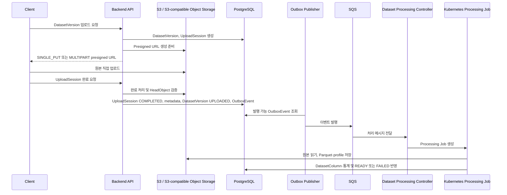

# ArgMax Mini 업로드·저장 처리 설계

## 1. 목적과 범위

이 문서는 사용자 CSV/XLSX 원본의 직접 업로드, 저장, 완료 검증 및 후속 처리를 위한 단일 운영 기준이다. 관계형 데이터 모델의 상세 컬럼·제약은 [data-model-v5.md](data-model-v5.md), 상태 전이는 [state-transitions-v4.md](state-transitions-v4.md), 시스템 책임은 [system-context-v3.md](system-context-v3.md), 설계 결정은 [architecture-decisions-v3.md](architecture-decisions-v3.md)를 따른다.

- Client는 S3에 원본 파일을 직접 업로드하며, API 서버는 파일 본문을 프록시하지 않는다.
- Dataset Processing Job은 비동기로 원본을 검증·파싱하고 Parquet 및 DatasetColumn·통계를 생성한다.
- 운영 환경은 AWS S3 Direct Upload를 사용한다. 로컬 평가 환경에서는 S3 API 호환 Object Storage로 대체할 수 있으나, presigned URL·Object Key·완료 검증 계약은 동일하게 유지한다.
- 허용 원본 형식은 CSV와 XLSX이며, 최대 원본 파일 크기는 `2,000,000,000 bytes`다.

## 2. 전체 흐름



텍스트 단계는 다음과 같다.

1. Client가 DatasetVersion 업로드를 요청하면 Backend API가 DatasetVersion과 UploadSession을 생성한다.
2. Backend API가 파일 크기로 업로드 방식을 선택하고 첫 presigned URL을 발급한다.
3. Client가 지정된 Object Key에 직접 업로드한 뒤 완료 API를 호출한다.
4. Backend API가 방식별 완료 처리를 수행하고 HeadObject로 객체 존재와 크기를 확인한다.
5. 완료 검증이 성공하면 하나의 DB 트랜잭션에서 아래를 모두 기록한다.
   - UploadSession을 `COMPLETED`로 전이
   - DatasetVersion의 원본 URI, 실제 크기, checksum metadata 기록
   - DatasetVersion을 `UPLOADED`로 전이
   - OutboxEvent 생성
6. Outbox Publisher가 SQS로 발행하고, Dataset Processing Controller가 Kubernetes Processing Job을 생성한다.
7. Job이 원본을 검증·변환하고 DatasetColumn·통계를 저장한 후 DatasetVersion을 `READY` 또는 `FAILED`로 전이한다.

## 3. 업로드 방식 선택

서비스 계층은 `expected_size_bytes`가 반드시 양수인지 검증한다.

| 조건 | `upload_method` | S3 작업 |
|---|---|---|
| `expected_size_bytes <= 16 MiB` | `SINGLE_PUT` | Presigned `PutObject` |
| `expected_size_bytes > 16 MiB` | `MULTIPART` | `CreateMultipartUpload` + presigned `UploadPart` |

`16 MiB = 16 × 1024 × 1024 bytes`다. MULTIPART의 현행 `part_size_bytes`는 16 MiB다.

## 4. UploadSession 불변조건

`upload_method`는 `SINGLE_PUT` 또는 `MULTIPART`다. [schema-v2.sql](../../database/schema-v2.sql)의 CHECK 제약과 [0001_initial_schema.py](../../alembic/versions/0001_initial_schema.py)는 다음 규칙을 강제한다.

| 방식 | `upload_id` | `part_size_bytes` |
|---|---|---|
| `SINGLE_PUT` | `NULL` | `NULL` |
| `MULTIPART` | NULL 불가 | NULL 불가·양수 |

`expected_part_count`는 DB 컬럼으로 저장하지 않는다. MULTIPART 완료 시에만 다음 식으로 계산한다.

```text
expected_part_count = ceil(expected_size_bytes / part_size_bytes)
```

완료 요청의 Part 번호는 중복·누락·범위 초과 없이 정확히 다음 집합과 같아야 한다.

```text
{1, 2, ..., expected_part_count}
```

## 5. 상태 전이와 URL 발급

UploadSession은 생성 시 `INITIATED`다. 최초 presigned URL 발급은 `INITIATED → UPLOADING`을 발생시키며, 이는 실제 S3 업로드 시작이 아니라 업로드 권한 발급을 의미한다.

- SINGLE_PUT은 단일 PUT URL을 최초 발급할 때 전이한다.
- MULTIPART는 유효한 첫 Part 번호의 URL을 최초 발급할 때 전이한다.
- 추가 URL 발급·재발급은 `UPLOADING` 상태를 유지한다.
- `INITIATED`, `UPLOADING` 모두 `expires_at`으로 만료를 판단한다.
- 완료 API는 만료되지 않은 유효한 `UPLOADING` 세션만 처리한다.

## 6. 완료 및 SHA-256 검증

| 방식 | 완료 처리 |
|---|---|
| SINGLE_PUT | 완료 요청에서 Multipart Part 목록을 받지 않는다. HeadObject로 객체 존재와 ContentLength를 확인한다. |
| MULTIPART | 제출 Part 번호 집합과 ETag를 검증하고 CompleteMultipartUpload를 호출한다. 이후 HeadObject로 객체 존재와 ContentLength를 확인한다. |

checksum의 책임은 분리한다.

```text
expected_checksum
= Client가 제공한 전체 파일 SHA-256

Multipart S3 ChecksumSHA256
= Part 기반 composite checksum
= 전체 파일 SHA-256과 직접 비교하지 않음

HeadObject
= 객체 존재 및 ContentLength 검증
= full-file SHA-256 직접 비교 안 함

Dataset Processing Job
= 원본 전체를 스트리밍해 SHA-256 재계산
= expected_checksum과 비교해 최종 무결성 검증
```

따라서 `UPLOADED`는 객체 생성과 크기 검증이 완료된 상태다. 서버가 전체 파일 checksum을 독립 검증한 상태는 아니다.

## 7. S3 저장 구조와 보안

환경마다 private bucket 하나를 사용한다.

```text
argmax-mini-{environment}-{aws_account_id}

datasets/original/{dataset_id}/{dataset_version_id}/source.{extension}
datasets/processed/{dataset_id}/{dataset_version_id}/data.parquet
datasets/processed/{dataset_id}/{dataset_version_id}/profile.json
```

- Object Key는 서버가 생성하며 Client는 지정하거나 변경할 수 없다.
- 원본 형식은 `DatasetVersion.file_format`, 처리본 URI는 `processed_storage_uri`에 기록한다.
- TLS 전송과 SSE-KMS 암호화를 사용한다.
- presigned URL은 지정 Object Key와 허용된 S3 동작에만 한정한다.
- URL 만료는 15분, UploadSession 만료는 24시간이다.

## 8. 비동기 Processing Job

처리 흐름은 다음과 같다.

```text
UPLOADED → PROCESSING
전체 파일 SHA-256 재계산
CSV/XLSX 안전성 검증과 파싱
Parquet 변환
DatasetColumn·통계 저장
READY 또는 FAILED
```

전체 파일 checksum 불일치, 파일 형식 오류, 안전성 제한 초과, 파싱·변환 실패는 `FAILED`로 처리한다.

### XLSX 안전성 제한

| 항목 | 제한 |
|---|---:|
| ZIP entry 수 | 10,000 이하 |
| 단일 entry 압축 해제 크기 | 2 GiB 이하 |
| 누적 압축 해제 크기 | 16 GiB 이하 |
| 압축률 | 100:1 이하 |
| worksheet 수 | 100 이하 |
| 처리 worksheet 수 | 1 |
| 행 수 | 10,000,000 이하 |
| 컬럼 수 | 1,024 이하 |
| 셀 수 | 100,000,000 이하 |

전체 압축 해제는 하지 않는다. streaming 또는 read-only parser로 제한을 적용하며, 처리 대상 worksheet는 하나다.

## 9. 실패·재시도·정리

| 사례 | 처리 |
|---|---|
| URL 미사용 만료 | UploadSession을 `EXPIRED`로 전이한다. DatasetVersion은 `UPLOADING`을 유지한다. |
| Multipart 업로드 실패 또는 사용자 중단 | UploadSession을 `FAILED` 또는 `ABORTED`로 전이한다. 재업로드는 새 UploadSession으로 수행한다. |
| CompleteMultipartUpload 결과 불확실 | 즉시 `FAILED`로 전이하지 않는다. HeadObject 또는 ListParts로 reconciliation한다. |
| 객체 크기 불일치 | UploadSession을 `FAILED`, DatasetVersion을 `FAILED`로 전이한다. |
| Processing Job checksum 불일치 | DatasetVersion을 `FAILED`로 전이한다. |
| 파일 파싱·보안 검증 실패 | DatasetVersion을 `FAILED`로 전이한다. |

재업로드 가능한 UploadSession 오류(`FAILED`, `EXPIRED`, `ABORTED`)에서는 DatasetVersion이 `UPLOADING`을 유지하고 새 UploadSession으로 재시도한다. 파일 무결성 오류가 업로드 완료 단계에서 확정되면 UploadSession과 DatasetVersion을 모두 `FAILED`로 전이한다.

S3 Lifecycle 정책은 다음과 같다.

- 미완료 Multipart Upload: 1일 후 Abort
- `FAILED` 원본: 7일 후 삭제
- `READY` 원본·처리본: DatasetVersion 보존 정책을 따른다.

## 10. 교차 참조

- 데이터 모델과 DB 제약: [data-model-v5.md](data-model-v5.md), [schema-v2.sql](../../database/schema-v2.sql)
- 상태 전이·재시도: [state-transitions-v4.md](state-transitions-v4.md)
- 시스템 경계·Outbox·SQS·Kubernetes Job: [system-context-v3.md](system-context-v3.md)
- S3 Direct Upload와 처리 Job 결정: [architecture-decisions-v3.md](architecture-decisions-v3.md)
